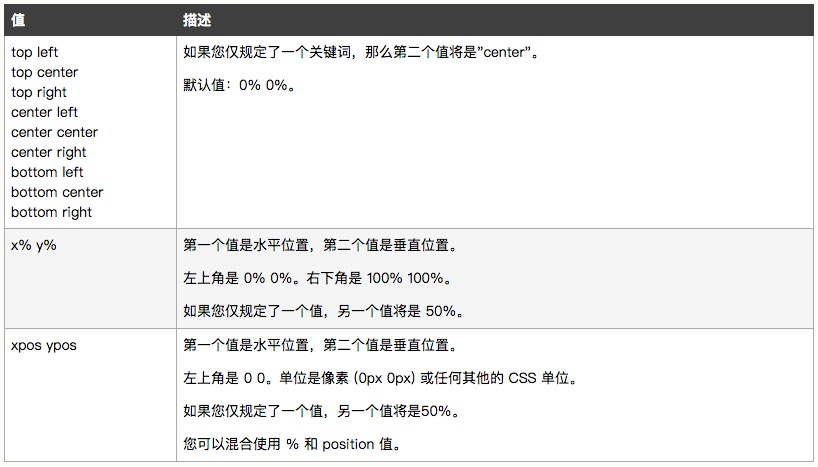
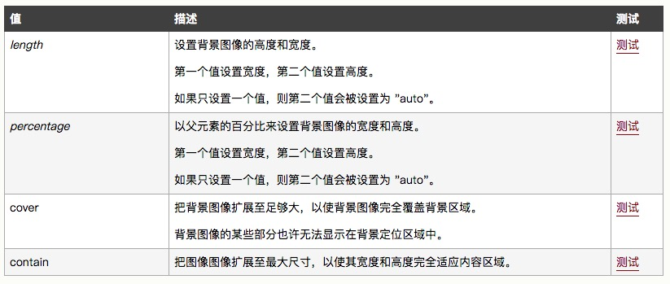

# 背景属性简写
```css
	body {
		background: #00ff00 url(" ") no-repeat top left 18px fixed;
	}
```

| 属性 | 属性值 |
| --- | ---- | 
| background-color | #00ff00 |
| background-image | url(" ") |
| background-repeat| repeat / repeat-x / repeat-y / no-repeat / inherit |
| background-position|  |
| background-size |  |
| background-origin | border-box / padding-box / content-box |
| background-clip | border-box / padding-box / content-box |
| background-attachment | scroll(默认值) / fixed / inherit |

